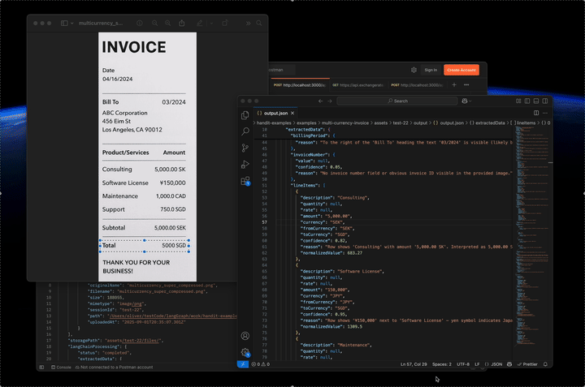
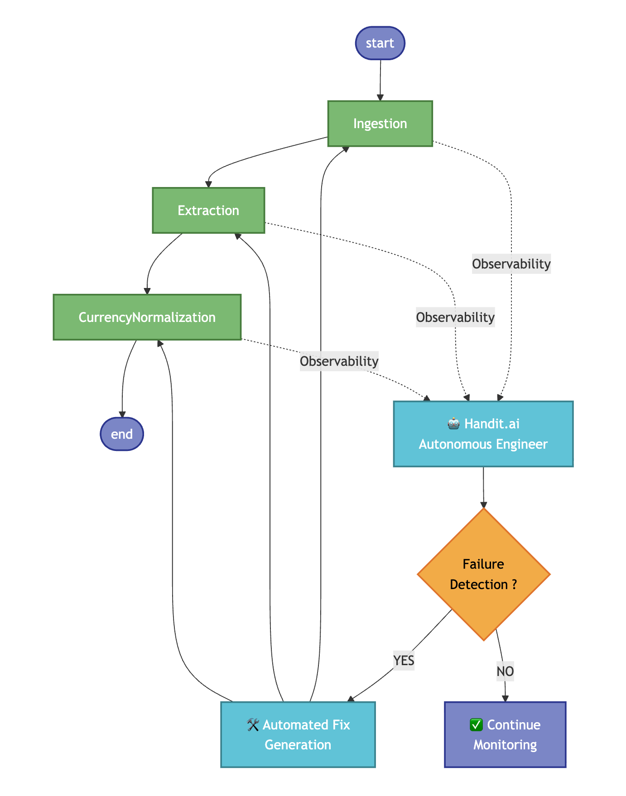

<p align="center">
  <!-- shows in LIGHT mode only -->
  
  <!-- shows in DARK mode only -->
  
</p>

<p align="center">
  <strong>🔥  Open Source AI Agent with Self-improvement Cpabilities 🔥</strong>
</p>

<p align="center">
  <a href="https://github.com/handit-ai/handit.ai/blob/main/LICENSE">
    
  </a>
  <a href="https://github.com/Handit-AI/handit-examples.git">
    
  </a>
  <a href="https://discord.com/invite/XCVWYCFen6" target="_blank">
    
  </a>
</p>

<p align="center">
  <a href="https://docs.handit.ai/quickstart">🚀 Quick Start</a> •
  <a href="https://docs.handit.ai/">📋 Core Features</a> •
  <a href="https://docs.handit.ai/">📚 Docs</a> •
  <a href="https://calendly.com/cristhian-handit/30min">📅 Schedule a Call</a>
</p>

---

# Multi-Currency Invoice

Self-improving AI agent that ingests multi-currency invoices, extracts all data, and automatically normalizes monetary values to a target currency (header currency) using latest or historical FX rates based on invoice date.



## 🏗️ Architecture Overview

This project uses an Express.js MVC structure with Handit.ai observability and AI-powered processing:



### 🔄 Workflow Stages

#### 1. Ingestion & Session
- Upload multiple files (images/PDFs) with `multer`
- Files stored under `assets/{session_id}/files/`

#### 2. AI Extraction (LangChain)
- Multimodal extraction of fields, tables, amounts, and currencies
- Parallel processing for faster results
- Structured JSON saved to `assets/{session_id}/structured/`

#### 3. Currency Normalization (LLM + Tools)
- Detect header currency and amounts in other currencies
- Convert values to header currency using ExchangeRate-API (latest/historical)
- Save normalized outputs to `assets/{session_id}/output/`

#### 4. Self-Improvement
- **Observability**
   - Every interaction with this AI agent is monitored by handit
- **Failure Detection**
   - Handit automatically identifies errors in any of our LLMs — like when a monetary value was not normalized correctly (Really important for this AI agent)
- **Automated Fix Generation**
   - If a failure is detected, Handit automatically fixes our prompts for us

## 📁 Project Structure

```
multi-currency-invoice/
├── controllers/
│   ├── HealthController.js
│   └── FileController.js
├── routes/
│   ├── healthRoutes.js
│   ├── fileRoutes.js
│   └── currencyRoutes.js
├── services/
│   ├── HealthService.js
│   ├── FileService.js
│   ├── ExtractionService.js
│   ├── CurrencyConverterService.js
│   └── CurrencyNormalizationService.js
├── assets/
│   └── {session_id}/
│       ├── files/
│       ├── structured/
│       └── output/
├── server.js
├── package.json
├── .env.example
└── README.md
```

## 🚀 Quick Start

### Prerequisites
- Node.js 18+
- npm
- API Keys: `HANDIT_API_KEY`, `OPENAI_API_KEY` and  `EXCHANGE_RATE_API_KEY` for historical rates

### Installation
1.  **Clone and Navigate**
   ```bash
   git clone https://github.com/Handit-AI/handit-examples.git
   cd examples/multi-currency-invoice
   ```
2. **Install**
   ```bash
   npm install
   ```
3. **Configure Env**
   ```bash
   cp .env.example .env
   # Edit .env with your keys (HANDIT, OPENAI, optional EXCHANGE_RATE_API_KEY)
   ```
4. **Run**
   ```bash
   # Development (nodemon)
   npm run dev
   
   # Production
   npm start
   ```

Service runs on `http://localhost:3000` by default.

## 📖 API Usage

### Health
```bash
curl http://localhost:3000/api/health
curl http://localhost:3000/api/health/detailed
curl "http://localhost:3000/api/health/check?include=basic,detailed,performance&timeout=5000"
```

### Upload & Process
```bash
curl -X POST "http://localhost:3000/api/files/upload" \
  -F "session_id=test-01" \
  -F "files=@./assets/test/multicurrency.png"
```

### Session Data
```bash
curl http://localhost:3000/api/files/session/test-01
curl http://localhost:3000/api/files/langchain/test-01
curl http://localhost:3000/api/files/normalization/test-01
```

### Currency
```bash
# Latest conversion
curl -X POST http://localhost:3000/api/currency/convert \
  -H "Content-Type: application/json" \
  -d '{"amount":100,"fromCurrency":"USD","toCurrency":"EUR"}'

# Historical conversion (requires EXCHANGE_RATE_API_KEY)
curl -X POST http://localhost:3000/api/currency/convert/historical \
  -H "Content-Type: application/json" \
  -d '{"amount":100,"fromCurrency":"USD","toCurrency":"EUR","date":"2023-12-05"}'

# Rates
curl "http://localhost:3000/api/currency/rate?fromCurrency=USD&toCurrency=EUR"
curl "http://localhost:3000/api/currency/rate/historical?fromCurrency=USD&toCurrency=EUR&date=2023-12-05"
curl "http://localhost:3000/api/currency/rates?baseCurrency=USD&symbols=[\"EUR\",\"GBP\"]"
curl "http://localhost:3000/api/currency/rates/historical?baseCurrency=USD&date=2023-12-05"
```

## 🤖 How It Works

### Extraction (LangChain + OpenAI)
- Reads actual file content (text or base64 for images/PDFs)
- Multimodal prompts to discover fields, tables, line items
- Returns clean JSON; stored per-file in `structured/`

### Normalization (LLM Tools + ExchangeRate-API)
- Detects monetary fields and their currencies
- Converts non-header currencies to header currency
- Uses latest or historical FX depending on provided date
- Outputs saved to `output/`

## 🔧 Configuration

Environment variables:
- `PORT` (default: 3000)
- `HANDIT_API_KEY` (required to start server)
- `OPENAI_API_KEY` and `OPENAI_MODEL` (default: gpt-5-mini-2025-08-07)
- `EXCHANGE_RATE_API_KEY` (enables historical rates)

## 🔒 Security & Monitoring
- Helmet, CORS, input validation
- Handit.ai tracing: ingestion, LLM calls, normalization steps
- Health endpoints for readiness and diagnostics


**Missing API keys**
- Ensure `.env` contains `HANDIT_API_KEY`, `OPENAI_API_KEY`, `EXCHANGE_RATE_API_KEY`.

## 📚 Resources
- **Handit.ai**: https://www.handit.ai/
- **Docs**: https://docs.handit.ai/
- **Dashboard**: https://dashboard.handit.ai/
- **Discord**: https://discord.com/invite/XCVWYCFen6

## 📝 License
MIT License — see [LICENSE](/LICENSE).
