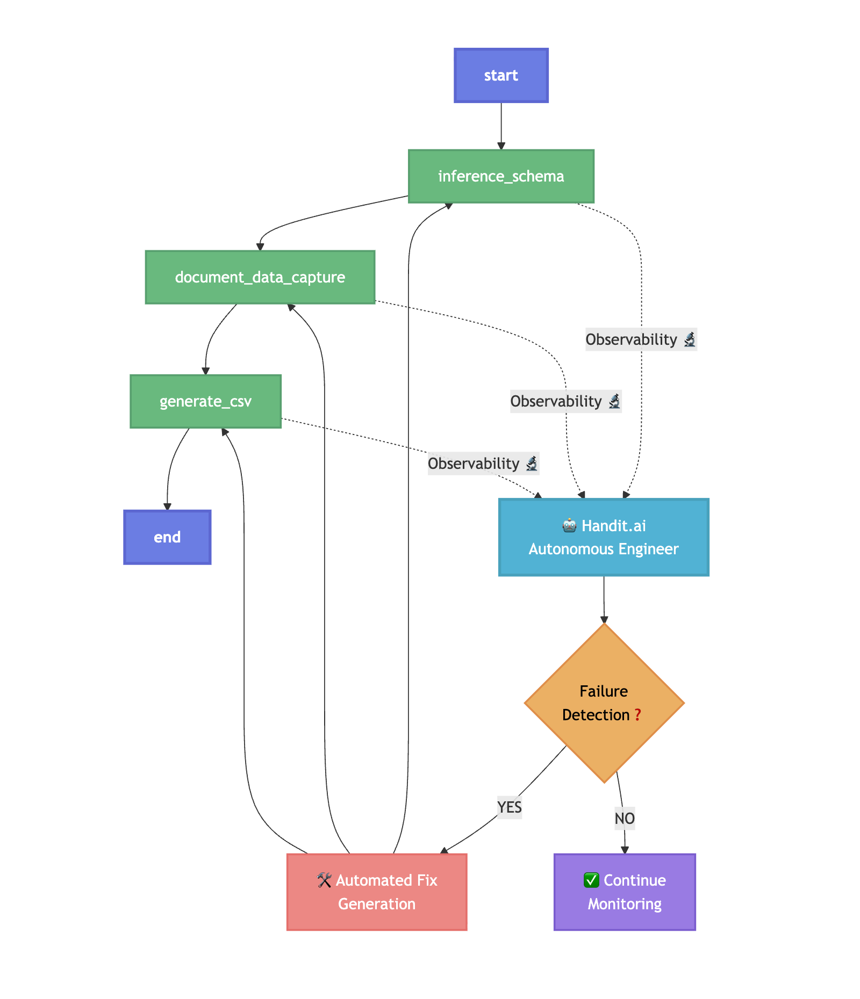

<p align="center">
  <!-- shows in LIGHT mode only -->
  
  <!-- shows in DARK mode only -->
  
</p>

<p align="center">
  <strong>🔥 Open Source AI Agent with Self-improvement Cpabilities 🔥</strong>
</p>

<p align="center">
  <a href="https://github.com/handit-ai/handit.ai/blob/main/LICENSE">
    
  </a>
  <a href="https://github.com/Handit-AI/handit-examples.git">
    
  </a>
  <a href="https://discord.com/invite/XCVWYCFen6" target="_blank">
    
  </a>
</p>

<p align="center">
  <a href="https://docs.handit.ai/quickstart">🚀 Quick Start</a> •
  <a href="https://docs.handit.ai/">📋 Core Features</a> •
  <a href="https://docs.handit.ai/">📚 Docs</a> •
  <a href="https://calendly.com/cristhian-handit/30min">📅 Schedule a Call</a>
</p>

---

# Unstructured to Structured

Self-improving AI agent that automatically converts messy, unstructured documents into clean, structured data and CSV tables. Perfect for processing invoices, purchase orders, contracts, medical reports, and any other document types.


### 🎯 What This Tool Solves

**The Problem:** You have documents sitting in PDFs, images, and text files that contain valuable data, but they're completely unusable in their current format. Manual data entry is slow, error-prone, and expensive.

**The Solution:** This AI system automatically:
- 🔍 **Analyzes** any document type (images, PDFs, text)
- 🧠 **Infers** the optimal data structure
- 📊 **Extracts** structured data with confidence scoring
- 📋 **Generates** organized CSV tables for analysis

## 🏗️ Architecture Overview

Let’s understand the architecture of our AI agent at a very high level:




### 🔄 Workflow Stages

#### 1. **Schema Inference** (`inference_schema`)
- **Purpose**: AI analyzes uploaded documents to create a unified JSON schema
- **Input**: All uploaded documents (images, PDFs, text)
- **Process**: Multimodal LLM analyzes document layouts and content
- **Output**: Structured JSON schema defining data fields and relationships
- **Key**: Automatically adapts to any document type and language

#### 2. **Data Extraction** (`document_data_capture`)
- **Purpose**: Maps document content to the inferred schema using AI extraction
- **Input**: Documents + inferred schema
- **Process**: Specialized LLM maps fields with confidence scoring
- **Output**: Structured JSON with field mappings, normalized values and reasoning
- **Key**: Field extraction with confidence metrics

#### 3. **CSV Generation** (`generate_csv`)
- **Purpose**: Convert structured JSON into clean CSV tables
- **Input**: Structured JSON from the previous node
- **Process**: LLM plans optimal table structure + pandas generation
- **Output**: Multiple CSV tables (general, items, addresses, etc.)
- **Key**: Intelligent table structure planning for complex nested data

**How does this AI agent gets better over time?**

Here is the secret weapon: [Handit.ai](https://www.handit.ai/)

1. **Observability**
   - Every interaction with our AI agent is monitored by handit  
2. **Failure Detection**
   - Handit automatically identifies errors in any of our LLMs — like when a CSV file doesn’t contain the right content (Really important for this AI agent)
3. **Automated Fix Generation**
   - If a failure is detected, Handit automatically fixes our prompts for us


## 📁 Project Structure

```
unstructured-to-structured/
├── 📄 main.py                    # FastAPI server with Handit.ai integration
├── 📋 requirements.txt           # Python dependencies
├── 🏗️ graph/                    # LangGraph workflow components
│   ├── 📊 graph.py              # Main workflow orchestration
│   ├── 🗃️ state.py             # Shared state passed between nodes
│   ├── ⚙️ consts.py             # Workflow constants
│   ├── 🔧 nodes/                # Individual workflow nodes
│   │   ├── 🧠 inference_schema.py
│   │   ├── 📝 document_data_capture.py
│   │   └── 📊 generate_csv.py
│   └── ⛓️ chains/               # LangChain processing chains
│       ├── 🔍 document_inference.py
│       ├── 📋 document_data_extraction.py
│       └── 🎯 generation.py
├── 🔌 services/                  # External service integrations
│   └── 📡 handit_service.py     # Handit.ai observability service
├── 📁 assets/                   # Input/output directories
│   ├── 📸 cover/                # Project assets
│   ├── 📊 csv/                  # Generated CSV outputs
│   ├── 🗃️ structured/          # JSON outputs
│   └── 📄 unstructured/         # Input documents by session
└── 📚 ARCHITECTURE.md           # Technical architecture details
```

## 🚀 Quick Start

### Prerequisites
- **Python**: 3.8 or higher
- **OpenAI API Key**: For LLM processing
- **Handit.ai API Key**: For observability, evaluation and self-improvement

### Installation

1. **Clone and Navigate**
   ```bash
   git clone https://github.com/Handit-AI/handit-examples.git
   cd examples/unstructured-to-structured
   ```

2. **Create Virtual Environment**
   ```bash
   python -m venv .venv
   source .venv/bin/activate  # On Windows: .venv\Scripts\activate
   ```

3. **Install Dependencies**
   ```bash
   pip install -r requirements.txt
   ```

4. **Configure Environment Variables**
   ```bash
   # Copy .env.example and edit with your values
   cp .env.example .env
   ```

   **Environment Variables Explained:**
   - `OPENAI_API_KEY`: Your OpenAI API key for accessing GPT models
   - `OPENAI_MODEL`: The specific OpenAI model to use (default: gpt-4o-mini)
   - `HANDIT_API_KEY`: Your Handit.ai API key for observability, evaluation and self-improvement

5. **Start the Server**
   ```bash
   python main.py
   ```
6. **Visit Handit Dashboard**
   - **Agent Tracing**: Monitor full observability at [https://dashboard.handit.ai/ag-tracing](https://dashboard.handit.ai/ag-tracing)
   - **Evaluation Hub**: Set up and manage your evaluations at [https://dashboard.handit.ai/evaluation-hub](https://dashboard.handit.ai/evaluation-hub)
   - **Optimization**: View and compare prompt versions at [https://dashboard.handit.ai/prompt-versions](https://dashboard.handit.ai/prompt-versions)

The API will be available at `http://localhost:8000`

## 📖 API Usage

### Health Check
```bash
curl http://localhost:8000/health
```

### Process Documents
```bash
curl -X POST "http://localhost:8000/bulk-unstructured-to-structured" \
  -F "session_id=invoice_batch_001" \
  -F "files=@invoice1.pdf" \
  -F "files=@invoice2.jpg" \
  -F "files=@purchase_order.docx"
```

### Interactive API Documentation
Visit `http://localhost:8000/docs` for Swagger UI documentation.

## 🔧 Configuration


### Supported File Types
- **Images**: PNG, JPG, JPEG, GIF, BMP
- **Documents**: PDF
- **Text**: Any text-based format (TXT, DOCX, etc.)

## 📊 Example Outputs

### Structured JSON
```json
{
  "core": {
    "document_type": {
      "value": "INVOICE",
      "normalized_value": "Invoice",
      "reason": "Large prominent text at top of document labeled 'Invoice'",
      "confidence": 0.99
    },
    "vendor_name": {
      "value": "Acme Corporation",
      "normalized_value": "Acme Corporation",
      "reason": "Top-left block under document title",
      "confidence": 0.98
    }
  },
  "financial": {
    "total_amount": {
      "value": "$1,234.56",
      "normalized_value": 1234.56,
      "reason": "Bottom-right total field clearly marked",
      "confidence": 0.99
    }
  }
}
```

### Generated CSV Tables
- **`general.csv`**: Document-level information (type, dates, parties)
- **`items.csv`**: Line item details (products, quantities, prices)
- **`addresses.csv`**: Contact and location information
- **`specialized_*.csv`**: Document-type specific data

## 🔍 How the Workflow Works

### 1. Schema Inference Node
```python
# Analyzes all uploaded documents simultaneously
# Creates unified JSON schema with field definitions
# Handles multilingual and mixed document types
# Generates schema with synonyms and validation rules
```

### 2. Data Capture Node
```python
# Maps document content to inferred schema
# Extracts structured data with confidence scores
# Handles multimodal input (images + text)
# Provides reasoning for each extracted field
```

### 3. CSV Generation Node
```python
# Plans optimal table structure for data
# Generates multiple CSV files using pandas
# Handles nested data, arrays, and complex structures
# Creates specialized tables for different data types
```

## 🚧 Development & Customization

### Adding New Document Types
The system automatically detects document types - no manual configuration needed. The schema adapts to your data.

### Customizing the Workflow
1. **Modify Nodes**: Edit functions in `graph/nodes/`
2. **Adjust Chains**: Update LLM prompts in `graph/chains/`
3. **Extend Schema**: Add custom fields by including examples

### Extending the Schema
- The inference system learns from your documents
- Add custom fields by including examples
- Schema evolves automatically with your data

## 🔒 Security & Privacy

### File Handling
- Files saved to session-specific directories
- No cross-session data leakage
- Temporary storage with cleanup policies

### API Security
- CORS configuration for web clients
- Session isolation
- Input validation and sanitization


## 🔮 Future Enhancements

### Planned Features
- **Enhanced PDF Support**: Page-by-page image extraction
- **Schema Validation**: Confidence scoring for schemas
- **Custom Field Mapping**: User-defined field rules
- **Batch Processing**: Queue-based processing for large sets

### Technical Improvements
- **Async Processing**: Non-blocking file processing
- **Database Integration**: Persistent schema storage
- **API Rate Limiting**: Prevent abuse
- **Advanced Monitoring**: Metrics and alerting

## 🤝 Contributing

We welcome contributions! Here's how to help:

### Areas for Improvement
- **PDF Processing**: Better PDF text extraction
- **Image Quality**: Handle low-quality scans
- **Schema Validation**: More robust schema inference
- **Performance**: Optimize for large document sets
- **Testing**: Add comprehensive test coverage

### Development Setup
1. Fork the repository
2. Create a feature branch
3. Make your changes
4. Add tests if applicable
5. Submit a pull request


## 🐛 Troubleshooting

### Common Issues

#### 1. **Handit.ai Configuration Error**
```bash
❌ HANDIT_API_KEY not found in environment variables
```
**Solution**: Add `HANDIT_API_KEY` to your `.env` file

#### 2. **OpenAI API Key Error**
```bash
❌ OPENAI_API_KEY not found
```
**Solution**: Add `OPENAI_API_KEY` to your `.env` file

#### 3. **File Upload Fails**
```bash
❌ Error saving file
```
**Solution**: Check file size, format, and permissions

#### 4. **Memory Issues**
```bash
❌ Out of memory error
```
**Solution**: Process documents in smaller batches

### Debug Mode
Enable detailed logging by setting log level to DEBUG in `main.py`.

## 📚 Resources & Documentation

### Handit.ai Resources
- **[Handit.ai Platform](https://www.handit.ai/)** - Autonomous AI engineering
- **[Documentation](https://docs.handit.ai/)** - Complete platform guide
- **[Dashboard](https://dashboard.handit.ai/)** - Start using Handit for free
- **[Community](https://discord.com/invite/XCVWYCFen6)** - Join our Discord


## 📄 License

This project is licensed under the MIT License - see the [LICENSE](LICENSE) file for details.


---

## 🆘 Need Help?

- **📚 Documentation**: [docs.handit.ai](https://docs.handit.ai/)
- **💬 Community**: [Discord](https://discord.com/invite/XCVWYCFen6)
- **📅 Schedule Call**: [Calendly](https://calendly.com/cristhian-handit/30min)
- **🐛 Issues**: [GitHub Issues](https://github.com/Handit-AI/handit-examples/issues)

**Questions?** Open an issue or start a discussion. We're here to help! 🚀
